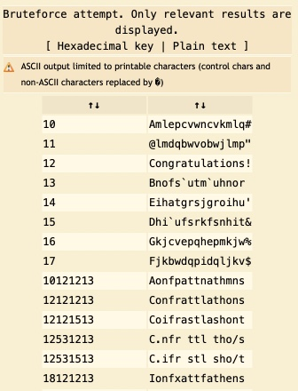

## Level03

Испольняемый файл был скомпилирован для 32-битной x86:

```sh
> file level03
level03: setuid setgid ELF 32-bit LSB executable, Intel 80386, version 1 (SYSV), dynamically linked (uses shared libs), for GNU/Linux 2.6.24, BuildID[sha1]=0x9e834af52f4b2400d5bd38b3dac04d1a5faa1729, not stripped
```
Функция `decrypt` применяет XOR-шифр к строке ``Q}|u\`sfg~sf{}|a3``, используя переданный ей аргумент в качестве ключа, и сравнивает полученный результат со строкой `Congratulations!`. Если строки совпадает, запускается оболочка.

С помощью [онлайн-шифрощика](https://www.dcode.fr/xor-cipher) мы находим, что необходимый ключ равен ~~12~~ 0x12 = 18:



Функция-прослойка `test` перенаправляет неизмененными только значения в диапазонах `0x1-0x9` и `0x10-0x15`. ~~Значит, мы не можем установить значение аргумента равным 12.~~

Следовательно, пароль равен `0x1337d00d + 18 = 322424863`, а токен – `kgv3tkEb9h2mLkRsPkXRfc2mHbjMxQzvb2FrgKkf`.